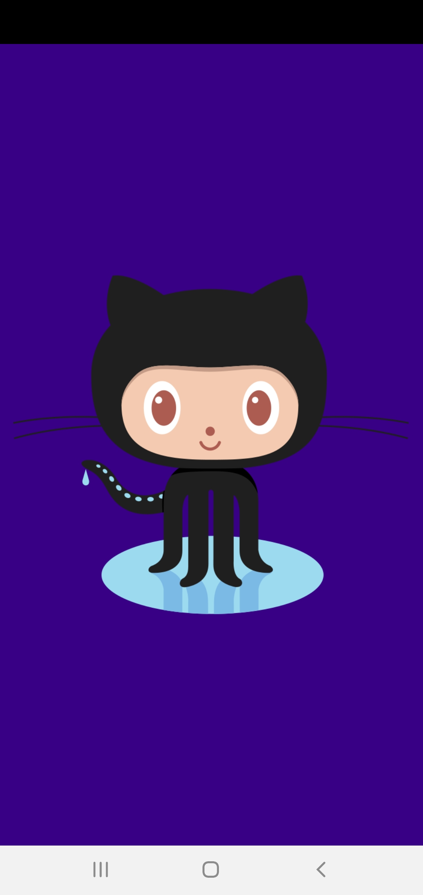

# github-pop
Repositório para o GitHub Pop Android (Kotlin)

<h1 align="center">
    GitHub Pop
</h1>

 
 

  <a href="#-projeto">Projeto</a>&nbsp;&nbsp;&nbsp;|&nbsp;&nbsp;&nbsp;
  <a href="#memo-licença">Licença</a>

 

  
  
  
  

## 💻 Projeto

GitHub Pop is a project that aims to present the ranking of GitHub repositories, according to the chosen language.

## :memo: Licença

This project is under the MIT license. See the archive [LICENSE](LICENSE.md) for more details.